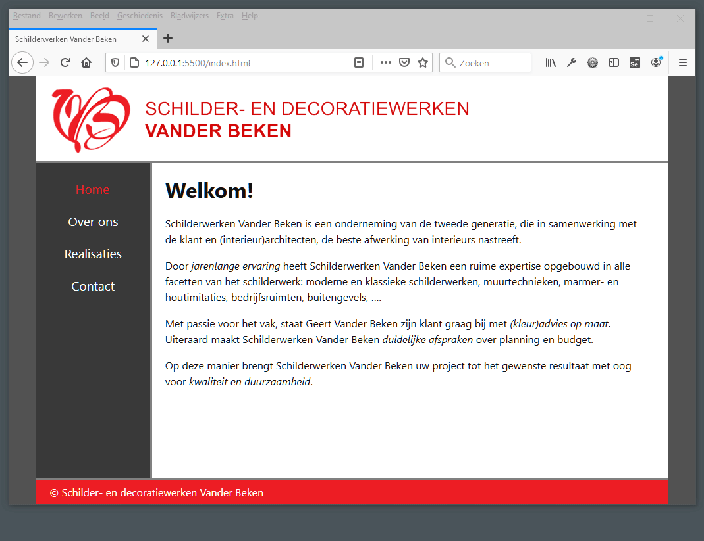
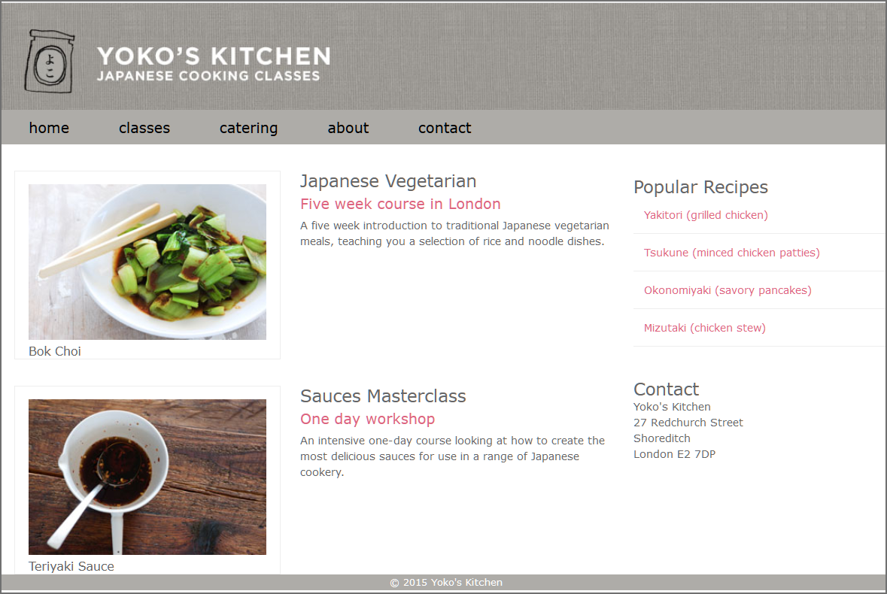

# Les 10 - Gevorderde oefeningen H10 - Flex Layout

Download of clone deze repository. 

De Developer Tools van de browser Mozilla Firefox zijn handiger om te werken met Grid Layout en Flex Layout dan de Developer Tools van Google Chrome. Gebruik dus voor deze oefeningen Mozilla Firefox in plaats van Google Chrome.

## Oefening 1: Vander Beken

- Open de map **vanderbeken** in Visual Studio Code.
- Veel lay-outs kan je zowel met grid als met flex op een vlotte manier maken. In de oefening **Vander Beken** heb je op de webpagina **over_ons.html** het section-element en het aside-element naast elkaar geplaatst met behulp van Grid Layout. Doe dit nu ook eens met behulp van Flex Layout.
- Niet elke webpagina in de 'Vander Beken'-website bevat altijd voldoende inhoud om het browservenster volledig te vullen. Pas de layout aan zodat de hoogte van de container steeds gelijk is aan de viewport-hoogte. Het te bekomen resultaat zie je in onderstaande animatie.

  

## Oefening 2: Yoko

- Open de map **yoko** in Visual Studio Code.

Deze map bevat een webpagina die enkele jaren geleden gemaakt is en waarbij de layout met floats en inline-block is uitgevoerd. Herwerk in deze pagina inline-block en alle floats naar Grid en/of Flex Layouts.  Er zijn meerdere oplossingen zijn mogelijk. De uit te voeren aanpassingen worden hieronder opgesomd:

1. Het h1-element en het a-element naast elkaar plaatsen, elimineer float. 
   Tip: plaats tijdelijk `display:none` in commentaar bij `nav ul`.

   

2. Navigatielinks naast elkaar plaatsen, elimineer inline-block.
3. 'figure' en '.description' naast elkaar plaatsen, elimineer float.
4. 'section' en 'aside' naast elkaar plaatsen, elimineer float.

   

